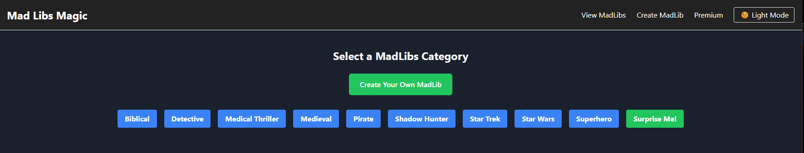

# MadLibs App


[MadLibs App](https://madlibsmagic.com/)  
*A fun, interactive app where users can create and play MadLibs stories!*

---

## 🔖 Badges

<p align="left">
  
  
  
  
  
</p>

---

## 🚀 Features

- **Create Custom MadLibs** – Type your own stories and insert placeholders with buttons.
- **Play MadLibs** – Fill in the blanks and generate funny stories.
- **Dark Mode Toggle** – Seamless dark/light mode switching.
- **Dynamic Forms** – Only placeholders used in the story appear in the form.
- **Organized Categories** – MadLibs are grouped into Adventure, Sci-Fi, Fantasy, Horror, Mystery, Comedy, Pirates, and Superheroes.
- **Fully Responsive** – Works on all devices.
- **Persistent Dark Mode** – Saves user preference.

## 📂 Project Structure

```bash
madlibs-app/
 ├── src/
 │   ├── app/                      # Next.js App Router Pages
 │   │   ├── layout.js             # Global layout (Navbar, Footer, Providers)
 │   │   ├── page.js               # Home Page
 │   │   ├── madlibs/              # MadLibs Section
 │   │   │   ├── page.js           # MadLibs List Page (Grouped by Category)
 │   │   │   ├── new/page.js       # Create New MadLib Page
 │   │   │   ├── [id]/page.js      # Individual MadLib Play Page (with Form)
 │   │   │   ├── madlibsData.js    # Contains predefined MadLib stories and categories
 │   ├── components/               # Reusable UI Components
 │   │   ├── Navbar.js             # Navigation bar with dark mode toggle
 │   │   ├── Footer.js             # Footer with author credit and links
 │   │   ├── ThemedApp.js          # Handles dark/light mode theme
 │   ├── context/                  # Global State Management (Context API)
 │   │   ├── MadLibsContext.js      # Stores & manages MadLibs
 │   │   ├── ThemeContext.js        # Manages dark/light mode state
 │   ├── styles/                    # Styling (CSS & Tailwind)
 │   │   ├── globals.css            # Global styles including dark mode
 │   ├── public/                    # Public Assets (Images, Favicons, etc.)
 │   ├── .env                        # Environment Variables (for future DB)
 │   ├── .gitignore                   # Ignore unnecessary files in Git
 │   ├── next.config.js               # Next.js configuration
 │   ├── package.json                 # Project dependencies
 │   ├── README.md                     # Documentation
```

## 🛠️ Installation & Setup

1. **Clone the repository**

   ```bash
   git clone https://github.com/bnelsonemail/madlibs-app.git
   cd madlibs-app
   ```

2. **Install dependencies**

   ```bash
   npm install
   ```

3. **Run the development server**

   ```bash
   npm run dev
   ```

4. Open [http://localhost:3000](http://localhost:3000) in your browser.

## 🎨 Theming (Dark Mode)

- The app includes a **dark mode toggle**.
- Dark mode preference is saved locally.
- Uses TailwindCSS to handle theming dynamically.

## 👨‍💻 Technologies Used

- **Next.js** – React framework for server-side rendering.
- **React Context API** – Manages state for MadLibs and theming.
- **Tailwind CSS** – Styles for dark mode and responsive design.

## 📜 License

This project is open-source under the **MIT License**.

## ✨ Author

**Created by: Brice Nelson**  
[GitHub](https://github.com/bnelsonemail) • [LinkedIn](https://www.linkedin.com/in/brice-a-nelson-p-e-mba-36b28b15/)

## 📌 To-Do (Future Enhancements)

- 🔹 **Database Integration** – Store MadLibs persistently.
- 🔹 **User Authentication** – Allow users to save and share their MadLibs.
- 🔹 **Animations** – Smooth transitions for UI elements.
- 🔹 **Custom Themes** – Let users select their own colors.

---

# 🧭 Version History

| Version | Date | Description |
|--------|------|-------------|
| **1.0.0** | Feb 2025 | Initial release. Full MadLib creator + player, category system, responsive design. |
| **1.1.0** | Aug 2025 | Added full **dark/light mode** toggle with persisted theme + added **contact footer** to all pages. |
| **1.2.0** | _Planned_ | Local storage persistence for user-created MadLibs. |
| **2.0.0** | _Planned_ | Backend integration (database + user authentication + saved library). |
| **2.1.0** | _Planned_ | Public story sharing + “featured stories” section. |
| **3.0.0** | _Planned_ | Full custom themes + multiple color palette options. |
